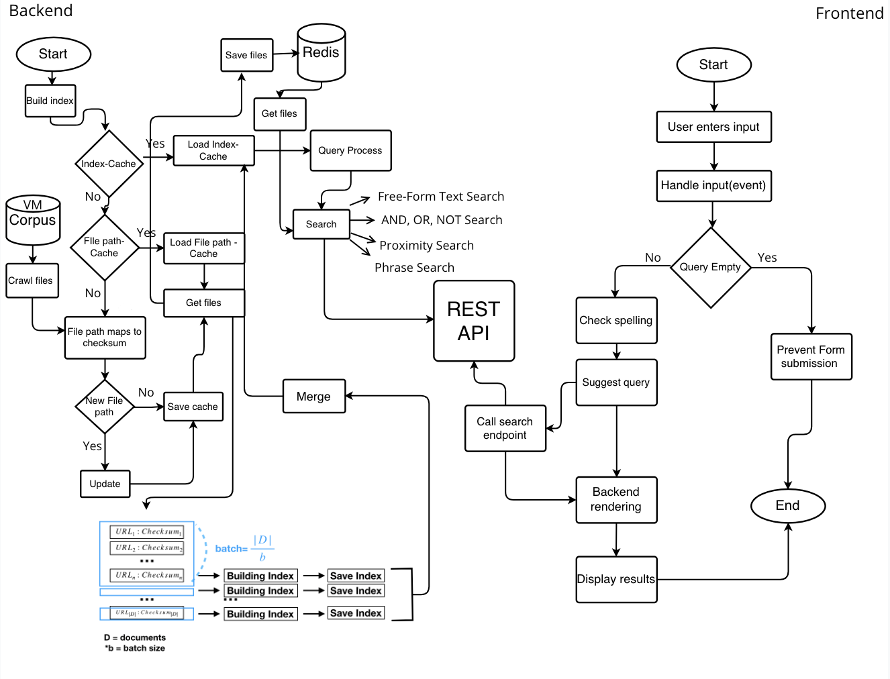
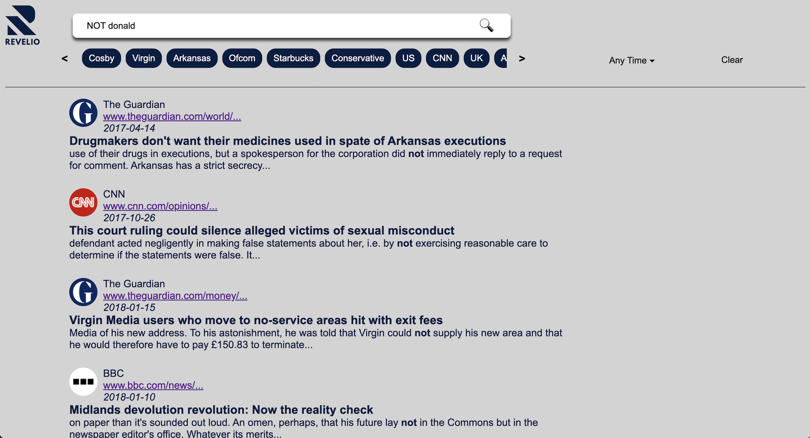
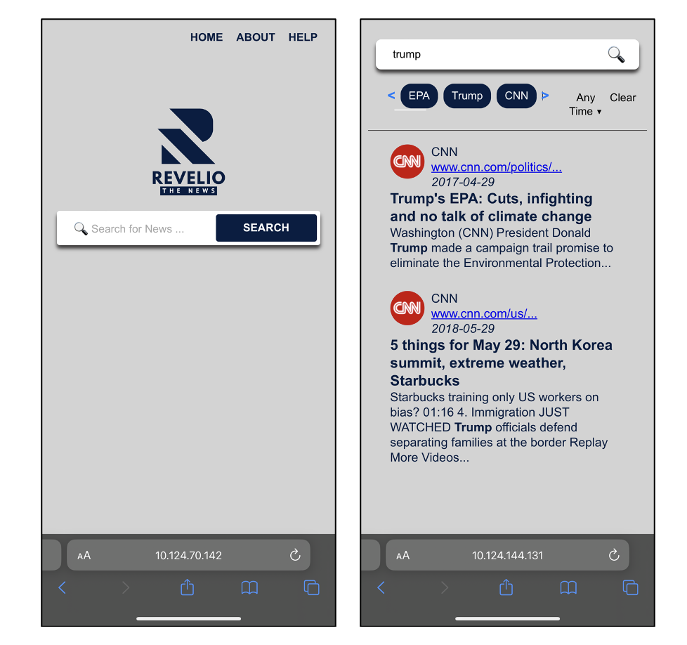

# Revelio: A Politically Balanced News Search Engine

## My Contribution 
- 
- **Led back-end development** of a scalable search engine architecture processing 300,000+ news articles, implementing core components for crawling, batch indexing, Trie-based retrieval, and Redis caching.
-  **Fine-tuned BERT-based sentiment estimators** (article- and entity-level) and optimized ranked search execution using heap-based scoring and time-capped BM25 retrieval.
-  **Led project planning and coordination**, aligning parallel development of major features under strict deadlines. The project was awarded **2nd-best among 18 teams**.

## 1. Why did you start your project?

We launched Revelio to address the growing demand for transparency and user control in news retrieval. While mainstream search engines like Google and Bing offer general news searches, they often lack granular features such as entity filtering and political balance. Our motivation was to create a more tailored user experience—allowing not only ranked and boolean queries but also advanced features like Named Entity Recognition, entity filtering, and real-time article ingestion. We identified a niche: a search engine that not only retrieves relevant articles but also empowers users to explore which people, organizations, and countries are being discussed, giving them more context and control.

## 2. What issues did you find technically and in a domain context?

### Domain Issues:
- Existing search engines don’t give visibility into *who* or *what* is being mentioned most in the results.
- Most news sources lean politically one way or another, risking biased search outputs.

### Technical Issues:
- Memory crashes while indexing 300,000+ documents due to large corpus size.
- Query processing latency in ranked search (initially up to 90 seconds).
- Difficulties implementing fair and efficient ranked retrieval with BM25 under time constraints.
- Live data imbalance from single-source APIs (e.g., Guardian) limits neutrality.
- Incomplete sentiment features raised concerns over bias and interpretability.

## 3. What solutions did you consider?

- **Architecture**: Explored local vs. cloud deployments and settled on Google Cloud Platform (GCP) with C2D instances and Redis caching for flexibility and scalability.
- **Indexing Strategy**: Moved from single-pass indexing to batch processing and index merging to handle memory limitations.
- **Ranking Models**: Compared TF-IDF and BM25, opting for BM25 for improved performance despite initial runtime issues.
- **Frontend Enhancements**: Designed a responsive UI with autocomplete, spelling correction, date filters, and named entity filters.
- **Sentiment Analysis**: Considered article- and entity-based sentiment scores, but scrapped due to ethical and usability concerns.

## 4. What is your final decision among solutions?

Our final system is a full-stack, production-ready news search engine with the following key components:

- **Optimised Indexing**: Batch-wise construction using Trie and Postings Linked Lists with skip pointers.
- **Advanced Search**: Support for boolean logic, phrase and proximity search, and BM25-based ranked retrieval with time-limited execution and heap-based scoring.
- **Entity Filtering**: Named entities are extracted via spaCy and displayed with frequency stats; users can filter by date or entity type.
- **Live News Ingestion**: Articles from The Guardian API are fetched and indexed daily at 22:00 using a Python job scheduler.
- **User Interface**: Built with HTML/CSS/JS + Flask, supports autocomplete, query suggestion, content highlighting, and mobile responsiveness.
- **Scalability**: Hosted on GCP Compute Engine, with Redis for caching and an extensible API-driven backend.

We scoped out sentiment features due to concerns around bias and misrepresentation. Instead, we focused on interpretability, fairness, and retrieval performance. Revelio demonstrates a scalable, ethical approach to intelligent news search.

### Architecture

### Search Engine Demo

